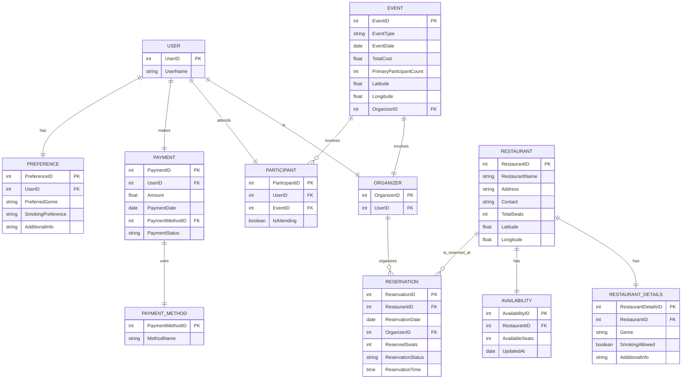

```mermaid
erDiagram 
    %% データベース1: ユーザー情報およびイベント情報
    USER {
        int UserID PK
        string UserName
    }

    ORGANIZER {
        int OrganizerID PK
        int UserID FK
    }

    PARTICIPANT {
        int ParticipantID PK
        int UserID FK
        int EventID FK
        boolean IsAttending
    }

    EVENT {
        int EventID PK
        string EventType
        date EventDate
        float TotalCost
        int PrimaryParticipantCount
        float Latitude
        float Longitude
        int OrganizerID FK
    }

    PAYMENT {
        int PaymentID PK
        int UserID FK
        float Amount
        date PaymentDate
        int PaymentMethodID FK
        string PaymentStatus
    }

    PAYMENT_METHOD {
        int PaymentMethodID PK
        string MethodName
    }

    PREFERENCE {
        int PreferenceID PK
        int UserID FK
        string PreferredGenre
        string SmokingPreference
        string AdditionalInfo
    }

    %% データベース2: レストラン情報および予約情報
    RESTAURANT {
        int RestaurantID PK
        string RestaurantName
        string Address
        string Contact
        int TotalSeats
        float Latitude
        float Longitude
    }

    RESTAURANT_DETAILS {
        int RestaurantDetailsID PK
        int RestaurantID FK
        string Genre
        boolean SmokingAllowed
        string AdditionalInfo
    }

    AVAILABILITY {
        int AvailabilityID PK
        int RestaurantID FK
        int AvailableSeats
        date UpdatedAt
    }

    RESERVATION {
        int ReservationID PK
        int RestaurantID FK
        date ReservationDate
        int OrganizerID FK
        int ReservedSeats
        string ReservationStatus
        time ReservationTime
    }

    EVENT ||--|| ORGANIZER : involves
    EVENT ||--o{ PARTICIPANT : involves

    USER ||--|| ORGANIZER : is
    USER ||--|| PARTICIPANT : attends
    USER ||--|| PAYMENT : makes

    PAYMENT ||--|| PAYMENT_METHOD : uses
    USER ||--|| PREFERENCE : has
    
    RESTAURANT ||--|| RESTAURANT_DETAILS : has
    RESTAURANT ||--|| AVAILABILITY : has
    RESTAURANT ||--o{ RESERVATION : is_reserved_at

    ORGANIZER ||--o{ RESERVATION : organizes


```