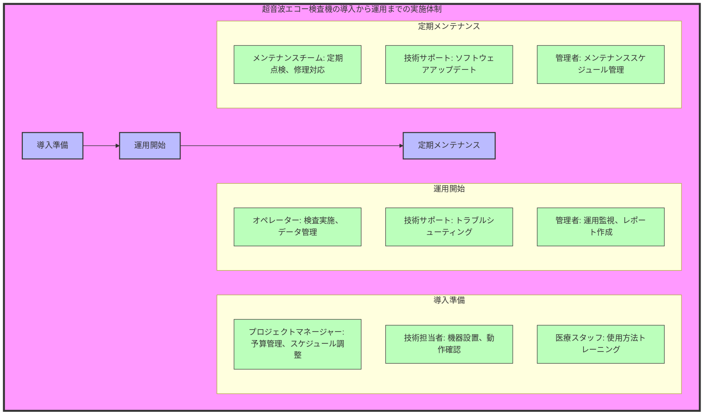
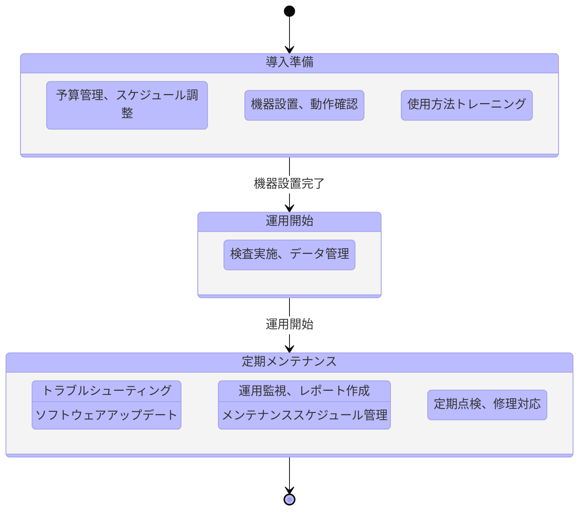

```mermaid
graph TB
    subgraph 超音波エコー検査機の導入から運用までの実施体制
        A[導入準備]
        B[運用開始]
        C[定期メンテナンス]

        A --> B
        B --> C

        subgraph 導入準備
            A1[プロジェクトマネージャー: 予算管理、スケジュール調整]
            A2[技術担当者: 機器設置、動作確認]
            A3[医療スタッフ: 使用方法トレーニング]
        end

        subgraph 運用開始
            B1[オペレーター: 検査実施、データ管理]
            B2[技術サポート: トラブルシューティング]
            B3[管理者: 運用監視、レポート作成]
        end

        subgraph 定期メンテナンス
            C1[メンテナンスチーム: 定期点検、修理対応]
            C2[技術サポート: ソフトウェアアップデート]
            C3[管理者: メンテナンススケジュール管理]
        end
    end

    style 超音波エコー検査機の導入から運用までの実施体制 fill:#f9f,stroke:#333,stroke-width:4px
    style A fill:#bbf,stroke:#333,stroke-width:2px
    style B fill:#bbf,stroke:#333,stroke-width:2px
    style C fill:#bbf,stroke:#333,stroke-width:2px
    style A1 fill:#bfb,stroke:#333,stroke-width:1px
    style A2 fill:#bfb,stroke:#333,stroke-width:1px
    style A3 fill:#bfb,stroke:#333,stroke-width:1px
    style B1 fill:#bfb,stroke:#333,stroke-width:1px
    style B2 fill:#bfb,stroke:#333,stroke-width:1px
    style B3 fill:#bfb,stroke:#333,stroke-width:1px
    style C1 fill:#bfb,stroke:#333,stroke-width:1px
    style C2 fill:#bfb,stroke:#333,stroke-width:1px
    style C3 fill:#bfb,stroke:#333,stroke-width:1px

```

```mermaid
%%{init: {'theme': 'base', 'themeVariables': { 'primaryColor': '#bbf', 'edgeLabelBackground':'#fff'}}}%%
stateDiagram-v2
    [*] --> 導入準備
    導入準備 --> 運用開始 : 機器設置完了
    運用開始 --> 定期メンテナンス : 運用開始
    定期メンテナンス --> [*]

    state 導入準備 {
        プロジェクトマネージャー : 予算管理、スケジュール調整
        技術担当者 : 機器設置、動作確認
        医療スタッフ : 使用方法トレーニング
    }

    state 運用開始 {
        オペレーター : 検査実施、データ管理
        技術サポート : トラブルシューティング
        管理者 : 運用監視、レポート作成
    }

    state 定期メンテナンス {
        メンテナンスチーム : 定期点検、修理対応
        技術サポート : ソフトウェアアップデート
        管理者 : メンテナンススケジュール管理
    }
```