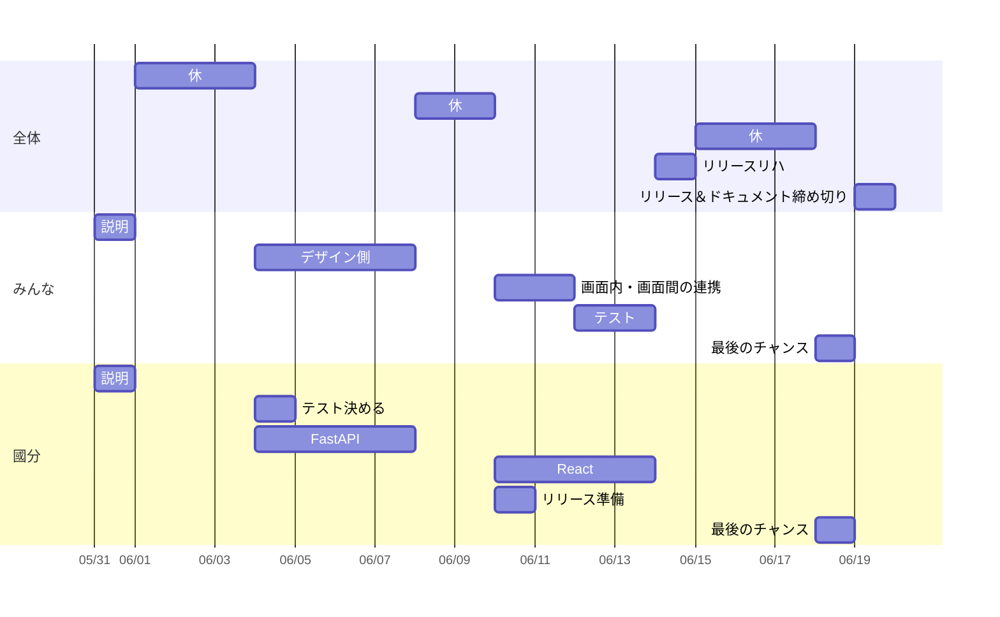
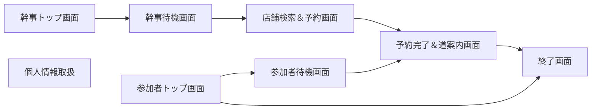
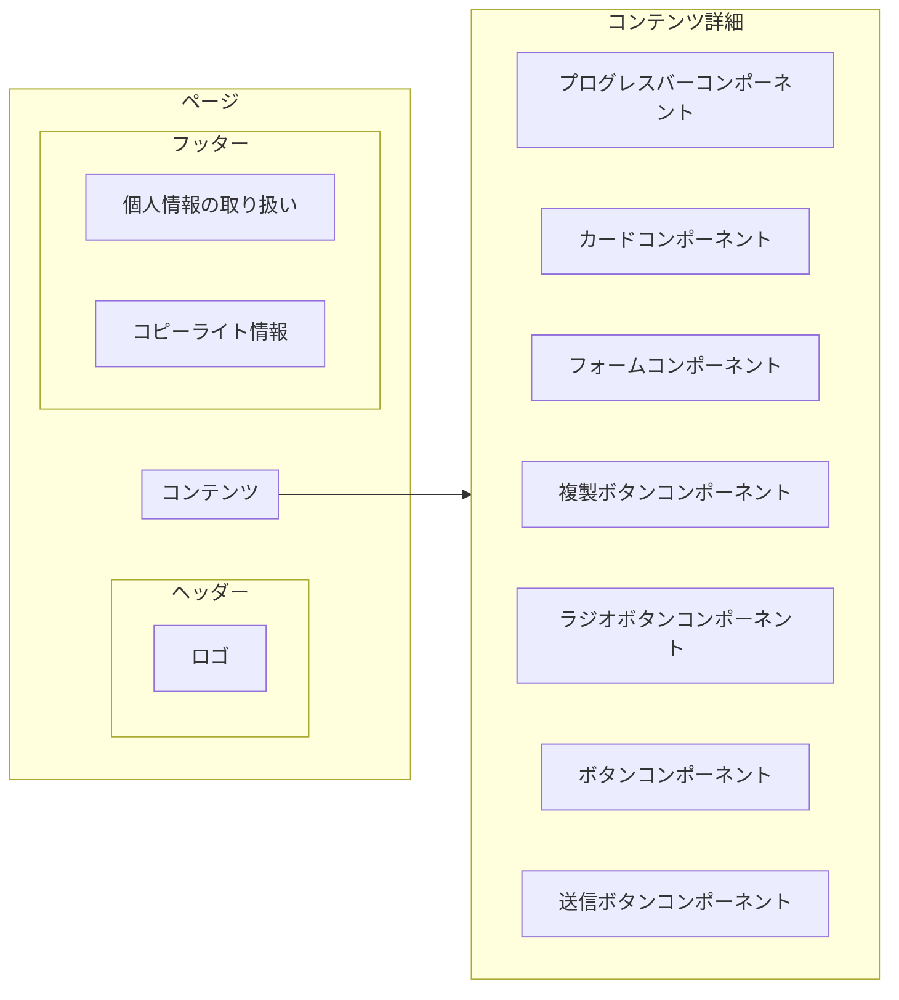

- [実装の全体感確認](#実装の全体感確認)
  - [ディレクトリ構造](#ディレクトリ構造)
  - [進め方ざっくりイメージ](#進め方ざっくりイメージ)
- [デザイン側でやること①](#デザイン側でやること)
  - [サイトの構造確認](#サイトの構造確認)
  - [ページの構成確認](#ページの構成確認)
    - [ここでやること](#ここでやること)
    - [例](#例)
  - [CSSの共通ルール](#cssの共通ルール)
    - [ここでやること](#ここでやること-1)
- [デザイン側でやること②](#デザイン側でやること-1)
  - [決めたルールで実際に作る！](#決めたルールで実際に作る)
  - [國分やること](#國分やること)

# 実装の全体感確認
## ディレクトリ構造
```
擬似プロジェクト/
├── backend/
│   ├── app/
│   │   ├── main.py
│   │   ├── models.py
│   │   ├── schemas.py
│   │   └── db.py
│   ├── db_setting/
│   └── requirements.txt
├── frontend/
│   ├── public/
│   │   ├── index.html
│   │   └── favicon.ico
│   ├── src/
│   │   ├── components/
│   │   │   ├── Header.js
│   │   │   ├── Header.module.css
│   │   │   ├── Footer.js
│   │   │   └── Footer.module.css
│   │   ├── App.js
│   │   ├── index.js
│   │   └── App.css
│   └── package.json
└── README.md

```

* backend/ではFastAPIとかをやります  
  * 幹事、参加者登録、店舗検索、予約などの機能
  * 特定のデータを渡して、保存・更新・取得するだけの関数

* frontend/では主に画面表示周りと一部機能をやります
  * まず画面の単純なデザイン（入力欄、ボタン、写真などの表示だけ）  
  →React(HTML,CSS) 
  * 次に画面内もしくは画面間の連携（参加人数とか値の受け渡しなど）  
  →React(Javascript)
  * React側だけで実装する機能実装（リアルタイム集計、現在地確認、地図関係）  
  * 最後にFastAPIとの連携（ボタンを押したら参加者登録する、DBから店情報を表示する）


## 進め方ざっくりイメージ
6/3から全体として実装に入れるといい感じ  
pikaメインでデザイン側(HTML,CSS)、國分メインで機能側をやっていく感じ？
テストはきのう


デザイン側は主にHTMLとCSSの調整  
あと少し画面内・画面間の連携のためにJavascriptをいじるイメージ  
余裕があったらFastAPIかReactのテスト

CustomCard.jsx
```jsx
import React from "react";
import styles from "./CustomCard.module.css"; 
// このCSSファイルをいじる

const CustomCard = () => {
  return (
    // このHTML文ファイルをいじる
    <div className={styles.card}>
      <p className={styles.label}>累計金額</p>
      <h2 className={styles.amount}>1,800</h2>
    </div>
  );
};

export default CustomCard;

```
CustomCard.module.css
```css
.card {
  background-color: var(--primary-color); /* オレンジ色の背景 */
  color: white; /* 白色の文字 */
  padding: 20px;
  border-radius: var(--border-radius);
  text-align: center;
}

.label {
  text-align: left; /* 左揃えに設定 */
  margin: 0;
  font-size: 0.9rem; /* 文字サイズを調整 */
}

.amount {
  margin: -0.5em;
  font-size: 2.5rem; /* 金額のフォントサイズを大きく */
  font-weight: bold;
  margin-bottom: 0.5px;
}

```

とりあえずデザイン、画面の表示だけ作る  


# デザイン側でやること①
## サイトの構造確認
一応
問題なければ次へ  


## ページの構成確認
各ページは共通するヘッダーとフッターを持つ  
コンテンツ部分にはページごとに必要なコンポーネントが配置される  
コンポーネント=再利用可能なデザインとか要素の単位  
↓を見るとコンポーネントのイメージしやすいかも（多分実装でもメインで使う？）  
[Bootstrapのサイト](https://react-bootstrap.netlify.app/docs/getting-started/introduction)

### ここでやること
* 画面デザインを見てコンテンツにどんなコンポーネントが必要か洗い出す 
* 被っていそうなものはまとめるて結局何を作るか決める


### 例


## CSSの共通ルール
CSS＝サイトのデザインに関わるところ  
文字などのサイズ、色、配置のルールを記述するもの

### ここでやること
画面デザインを見て共通するものは先に決める
* 文字サイズ（標準・大・小それぞれ）
* 色（メイン・サブ・背景）
* マージン（画面端から・コンポーネント間）
* 角の丸め
* ヘッダー・フッター
  * サイズ（高さ・幅）
  * 色
  * 配置（固定・非固定）
* その他コンポーネントで共通するもの


決めてくれれば↓みたいに設定できます

```css
:root {
    --primary-color: #ffbf00;
    --secondary-color: #c5c5c5;
    --background-color: #ffffff;
    --test1-color: #aaaaaa;
    --test2-color: #e6e4e4;
    --text-color: #000000;
    --font-size: 16px;
    --font-size-large: 20px;
    --font-size-small: 14px;
    --margin-td: 16px;
    --margin-lr: 8px;
    --padding: 16px;
    --border-radius: 12px;
}
```

# デザイン側でやること②
## 決めたルールで実際に作る！
ヘッダー・フッターなどサイト全体でよく使うものから作るのオススメ

## 國分やること
* 作業する場所作る
* React構造説明
* 名前ルール決める