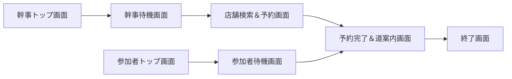
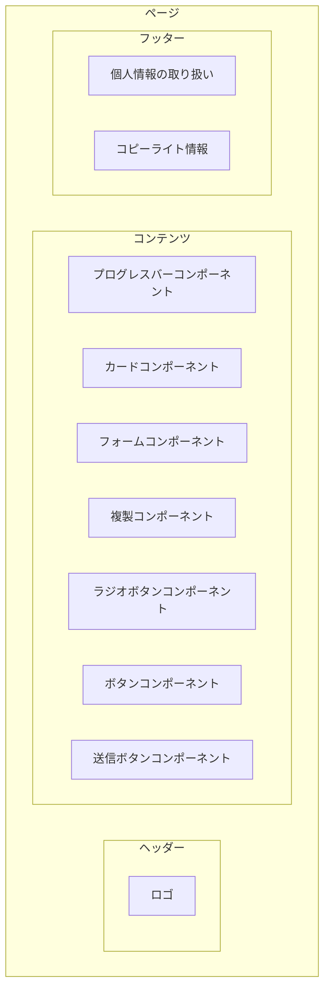

# サイト構造

# ページの構成
各ページは共通するヘッダーとフッターを持つ。  
コンテンツには適宜コンポーネントが追加される。

# CSSの共通ルール
* Bootstrapを使う
* 画面サイズはiPhoneSEを想定
* 文字サイズは16pxが基本
* 文字色は黒
* 基本色はオレンジ
* 補助色は灰色
* 背景は白
* 角は丸める
* ヘッダーとフッターは画面両端まで使う
* ヘッダーとコンテンツは下線で分ける
* フッターは固定
* コンテンツは両端から16px離す
* 各コンポーネントでパディングはなし、マージンは下に16px
